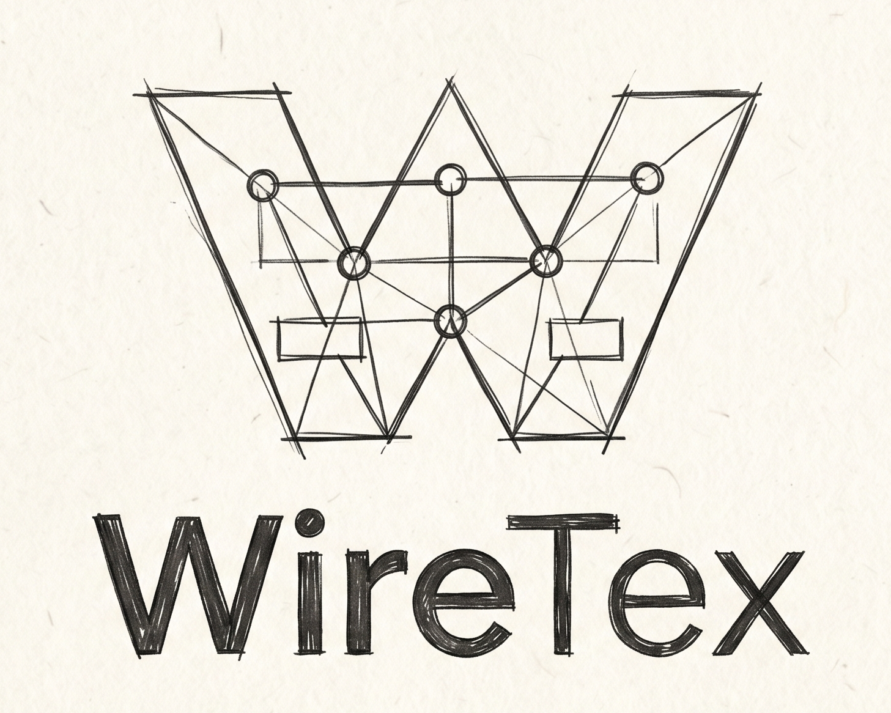

<p align="center">
  
</p>

WireTex is a markdown-like language for sketching UI wireframes in plain text. Write compact markup on the left, preview styled wireframes on the right.

**Live demo:** [wiretex.xyz](https://wiretex.xyz)

This repo contains the **grammar**, **HTML renderer**, and a **Next.js live editor**.

## Quick start

```bash
npm install
npm run dev
```

Open [wiretex.xyz](https://wiretex.xyz) for the live site, or run locally at [http://localhost:3000](http://localhost:3000) after `npm run dev`. Try the [sandbox](/sandbox) editor and [docs](/docs).

The parser is generated from `lib/wiretex/grammar.pegjs` on every `dev` and `build`:

```bash
npm run generate-parser
```

## How it works

```
WireTex markup  →  lib/wiretex/grammar.pegjs (Peggy)  →  AST  →  lib/wiretex/renderer.ts  →  HTML  →  preview
```

1. **Author markup** in the editor (or any text file). Syntax is line-oriented, similar to markdown with UI-specific tokens.
2. **Parse** with Peggy. The grammar lives in `lib/wiretex/grammar.pegjs`; the compiled parser is written to `lib/wiretex/parser.generated.js` (gitignored, rebuilt automatically).
3. **Render** the AST to HTML in `lib/wiretex/renderer.ts`. Output uses `utext-*` CSS classes and theme CSS variables (`--wt-bg`, `--wt-accent`, etc.).
4. **Preview** in the sandbox at `/sandbox`. The editor parses on every change and injects HTML into an isolated preview pane (imperative `innerHTML`, not React children, so app controls stay interactive).

### Project layout

```
app/                    Next.js routes (landing, sandbox, docs, chat)
  actions/              Server actions for AI generation
components/
  layout/               SiteNav
  docs/                 Docs sidebar and headings
  editor/               Sandbox editor, preview, themes, device frames
  chat/                 AI wireframe generator UI
  landing/              Homepage demo
lib/
  wiretex/              Grammar, parser, renderer (core language)
  site/                 Docs data, themes, sample markup
  generator/            AI prompts, Together client, output sanitization
  security/             Rate limiting, Turnstile verification
  preview/              PNG export helper
models/                 Ollama Modelfile (synced from generator prompt)
scripts/                Build/sync scripts
skills/                 Agent instructions for wireframe generation
public/                 Static assets
```

| Path | Purpose |
|------|---------|
| `lib/wiretex/grammar.pegjs` | Source grammar — edit this to add syntax |
| `lib/wiretex/renderer.ts` | AST → HTML — swap for React, Tailwind, etc. |
| `lib/wiretex/parse.ts` | Thin wrapper around generated parser |
| `lib/site/docs.ts` | Component reference data for `/docs` |
| `lib/site/themes.ts` | Built-in themes and CSS variable keys |
| `lib/site/sample.ts` | Default sandbox example |
| `lib/generator/` | System prompt, Together AI client, `/chat` generation |
| `app/chat/` | AI wireframe generator page |

## Editor features

- **Live preview** — left panel for markup, right panel for rendered wireframe
- **Themes** — Sketch, Blueprint, Dark, Paper; customise with hex values in the header
- **Device frames** — Web (~960px) and Mobile (~390px) preview containers
- **Parse errors** — shown below the editor when markup is invalid

## WireTex syntax (cheat sheet)

### Text and structure

| Syntax | Output |
|--------|--------|
| `# Title` | Heading (supports `#` … `######`) |
| Plain line | Paragraph |
| `**bold**` `*italic*` `~~strike~~` `` `code` `` | Inline formatting |
| `***` alone on a line | Horizontal rule |

### Inputs

| Syntax | Field type |
|--------|------------|
| `___` | Text |
| `@@@___` | Email |
| `***___` | Password |
| `#___` | Number |
| `__-__-____` | Date |
| `[___]` per line | Textarea (one row per line) |

**Important:** prefixes (`@`, `*`, `#`) set the field type; **`___` is required**. `@@@` alone is plain text; `***` alone is a horizontal rule.

### Buttons

| Syntax | Type |
|--------|------|
| `[Save]` | Button |
| `[>Submit<]` | Primary / submit |
| `[!Reset!]` | Secondary / reset |

### Blocks

| Syntax | Block |
|--------|-------|
| `---Title---` … `---` | Card |
| `===Title===` … `===[btn][btn]===` | Modal |
| `!!!Legend!!!` … `!!!` | Form fieldset |

### Lists and data

| Syntax | Output |
|--------|--------|
| `[x] Label` / `[] Label` | Checkbox group |
| `(x) Label` / `() Label` | Radio group |
| `<[Option]>` per line | Dropdown (`-` in text marks disabled) |
| `\|*A\|*B\|` / `\|a\|b\|` | Table (`*` prefix = header cell) |
| `% 65 %` | Progress bar |
| `~ 65 ~` | Slider |
| `( ... )` / `(...)` | Loading indicator |
| `- Item` | Bullet list (one per line) |
| `{Badge}` | Badge (inline or on its own line) |
| `?___` | Search field |
| `^___` | File upload |
| `[ Home \| Settings ]` | Tabs (must contain `\|`) |
| `[[Chart title]]` | Chart placeholder |
| `:::` … `----` … `:::` | Two-column layout |
| `[/Home/Settings]` | Breadcrumb |
| `[ [Home](/) [About](/about) ]` | Nav bar |

### Images

| Syntax | Output |
|--------|--------|
| `` | Placeholder image (wireframes use `#` only; remote URLs are not loaded) |
| `{` … `}` wrapping multiple `` lines | Equal-width image group in a fixed-height row |

### Code

````markdown
```lang
line one
line two
```
````

## Themes

Built-in themes define CSS variables consumed by `.wiretex-content` in `app/globals.css`:

`bg`, `text`, `cardBg`, `btnPrimaryBg`, `btnPrimaryText`, `btnSecondaryBg`, `btnSecondaryText`, `surface`, `muted`, `border`, `accent`, `accentText`, `inputBg`, `codeBg`, `shadow`

Click **Customise theme** in the sandbox to edit hex values (and `rgba(...)` for shadow).

## Extending WireTex

1. Add rules to `lib/wiretex/grammar.pegjs`
2. Run `npm run generate-parser`
3. Add node types and HTML output in `lib/wiretex/renderer.ts`
4. Style new classes in `app/globals.css`
5. Add an entry to `lib/site/docs.ts` for the `/docs` page

To target a different output (React components, PDF, Figma plugin), replace or alternate `lib/wiretex/renderer.ts` — the grammar and AST stay the same.

## Generating wireframes with AI assistants

Shared agent instructions live in **`skills/wiretex-wireframes/`**. See **`skills/README.md`** for how to use them with Cursor, GitHub Copilot, Claude Code, and other tools.

Example prompt:

> Read `skills/wiretex-wireframes/instructions.md` and create a wireframe for a checkout page.

This repo also includes:

- **`AGENTS.md`** — project context for any coding agent
- **`.cursor/skills/wiretex-wireframes/`** — Cursor skill entry point
- **`.github/copilot-instructions.md`** — GitHub Copilot workspace instructions
- **`CLAUDE.md`** — Claude Code project instructions

## Scripts

| Command | Description |
|---------|-------------|
| `npm run dev` | Generate parser + start dev server |
| `npm run build` | Production build |
| `npm run start` | Serve production build |
| `npm run generate-parser` | Compile `lib/wiretex/grammar.pegjs` only |
| `npm run sync-system-prompt` | Sync generator prompt to `lib/generator/` and `models/Modelfile` |
